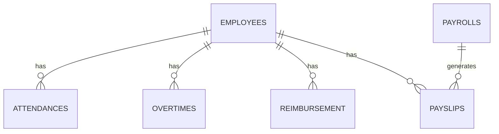

# Payslip Generator – Software Architecture Documentation

## 1. Overview

The Payslip Generator is a web-based payroll and attendance management system designed for HR/admin and employee use.
It automates attendance, overtime, reimbursement, payroll calculation, and payslip generation.

---

## 2. Architecture Diagram

```
[Browser/Client]
     │
     ▼
[Node.js Express REST API]
     │
     ▼
[Sequelize ORM]
     │
     ▼
[PostgreSQL Database (Docker Container)]
```

* **User roles:** Admin, Employee

---

## 3. Tech Stack

* **Backend:** Node.js with Express.js
* **ORM:** Sequelize
* **Database:** PostgreSQL (runs in Docker)
* **Auth:** JWT-based, with middleware for authorization
* **Version control:** Git
* **Documentation:** Markdown, Postman
* **Test:** Jest, Supertest

---

## 4. Database Design (ERD Summary)

[See: Mermaid ERD](https://www.mermaidchart.com/app/projects/18e40684-2b9c-49e3-804e-eee8c7871fc4/diagrams/57b3fc83-65ef-4ee9-82b6-a81ffbcf33a1/version/v0.1/edit)

* **Main entities:**

  * `EMPLOYEES`, `ADMINS`, `ATTENDANCES`, `OVERTIMES`, `REIMBURSEMENT`, `PAYROLLS`, `PAYSLIPS`, `AUDIT_LOGS`

* **Relationships:**

  * Employees can have many attendances, overtimes, reimbursements, payslips
  * Payroll generates payslips (one-to-many)
  * Audit logs record actions for all tables

**Example Entity:**



---

## 5. Core Modules & Responsibilities

* **UserController:** Handles login/authentication for employees/admins
* **AttendaceController:** Employee check-in/check-out logic
* **OvertimeController:** Overtime submission logic
* **ReimbursementController:** Reimbursement submission
* **PayrollController:** Payroll period creation, payroll processing
* **PayslipController:** Payslip retrieval, payroll summaries
* **Middleware:** Authentication and authorization checks (JWT)
* **Audit Logging:** All data changes are tracked for traceability

---

## 6. Process Flow

### Example: Payroll Calculation

1. **Admin submits payroll period**
2. **Admin run payroll and system calculates:**
   * Attendance days × salary
   * Overtime hours × overtime rate
   * Total approved reimbursements
3. **System generates payslips for all employees**
4. **Payslips are saved and accessible to employees**

---

## 7. Security & Best Practices

* Passwords are **hashed** in DB (never plain text)
* All sensitive endpoints require authentication
* Role-based access (employee vs. admin)
* Inputs are validated on backend
* Audit logging for every create/update/delete

---

## 8. Useful Scripts & Tools

* `npm run dev` (nodemon for hot reload)
* `docker-compose up` (if using docker-compose)
* `sequelize-cli` for migrations/seeding
* `dbeaver` or `TablePlus` for DB visualization

---

## 9. Example .env file

```
DB_HOST=localhost
DB_PORT=5432
DB_USER=postgres
DB_PASSWORD=yourpassword
DB_NAME=payslip
JWT_SECRET=your_jwt_secret
```

---

## 10. Future Enhancements (Ideas)

* Export payslip as PDF
* Email notification integration
* UI dashboard (React, Vue, etc.)
* SSO or OAuth login
* Using Redis for caching:
Cache frequently requested data (e.g., employee profiles, payroll summaries) to improve API response speed and reduce DB load.
* Using RabbitMQ or BullMQ for queueing:
Implement background jobs/queues for resource-intensive or asynchronous tasks, such as:
* Sending email notifications (e.g., payslip delivery)
* Payroll batch processing
* Generating reports
* Data synchronization or third-party integrations

---